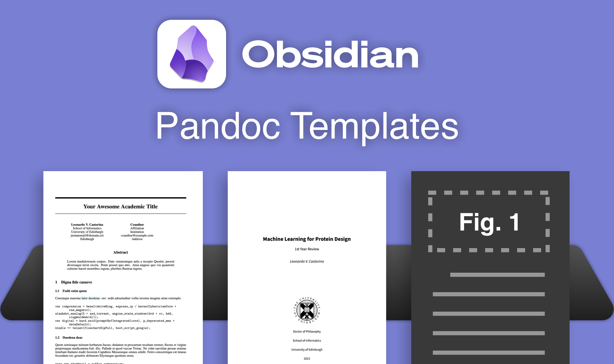

# Academic Pandoc Templates

<div align="center">
  <br>
</div>

A repository for academic templates. Geared for Pandoc and Obsidian.

## Why Templates? 

I wanted an easy way to produce graphically-pleasing academic documents from my Obsidian notes.

Obsidian (+pandoc) is easy to use, can handle LaTeX-style citations, figure references, and export to `.tex`, `.pdf`, `.bib` and so on.  

## How to use?

### Complete Set Up

A step-by-step guide is available here: [Obsidian Tutorial for Academic Writing](https://betterhumans.pub/obsidian-tutorial-for-academic-writing-87b038060522)

It will guide you through syncing Zotero and Obsidian, setting up Pandoc, and referencing figures and citations. 

### Partial Set Up

If you just want to install the templates in your pandoc: 

1. Type `pandoc --version` in the terminal
2. Find the User data directory: e.g. `/Users/leo/.local/share/pandoc`
3. If the folder above does not exist, create it.
4. Copy the folder of your template(s) of interest in there.

If you need more guidance, look into Section 4 of the [Obsidian Tutorial for Academic Writing](https://betterhumans.pub/obsidian-tutorial-for-academic-writing-87b038060522) . 

## Contributing

Do you have an Academic Pandoc Template? Open a pull request! 

Templates should be added in the following formats:

```
TemplateName/
├─ example/
│  ├─ example.md
│  ├─ example.pdf
├─ TemplateName.tex
├─ README
├─ TemplateName.sty
```

The `README` file should contain a description of the template.

The `example` folder should contain the markdown `.md` file used to generate the folder and the output PDF `.pdf` file generated. 

You may include additional files such as image (sparingly) and `.bib` files.  
