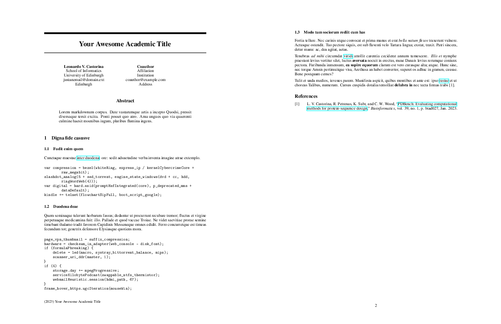

# Dissertation Template

## Preview

<a href="example/neurips.pdf"> </a>

## Description

Neurips template modified from the 2023 Neurips Template. 

## Sample YAML Setup

Place the following at the top of your markdown file:

```
---
title: Your Awesome Academic Title
abstract: Lorem markdownum corpus. Date vastarumque artis a incepto Quodsi,
  pressit diversaque tersit excita. Ponti posset quo atro. Ama ungues quo via
  quaerenti culmine haesit moenibus iugum, pluribus flumina ingens.
authors:
  - name: Leonardo V. Castorina
    affiliation: School of Informatics
    institution: University of Edinburgh
    email: justanemail@domain.ext
    address: Edinburgh
  - name: Coauthor
    affiliation: Affiliation
    institution: Institution
    email: coauthor@example.com
    address: Address
reference-section-title: References
---
```

`reference-section-title` is the title right above the bibliography. Every author needs to be defined within `authors` as such:

```
  - name: Name LastName
    affiliation: Affiliation
    institution: Institution
    email: coauthor@example.com
    address: Address
```


